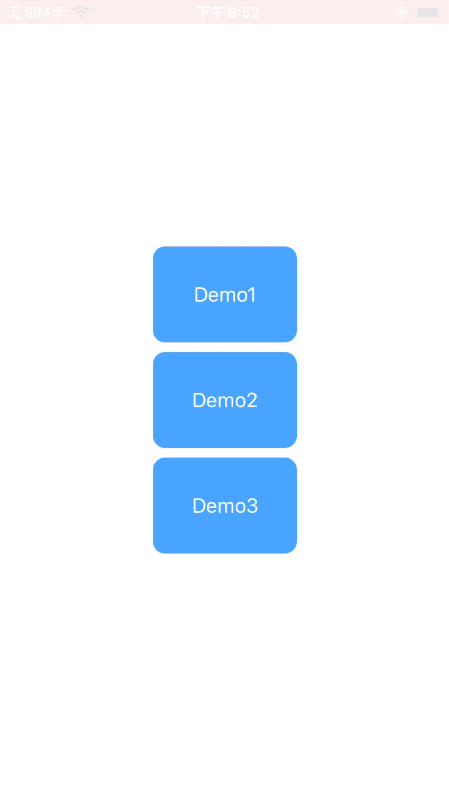
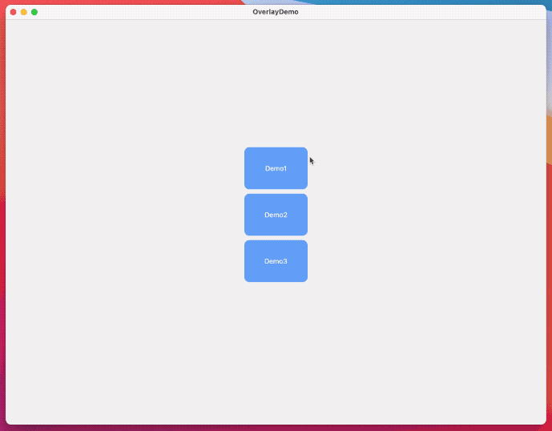

# SwiftUIOverlayContainer

这是在全窗口下,显示各种弹出式View的SwiftUI库.目前支持 iOS 13 和 macOS
库代码已经修改可以直接在xcode11下使用

A  SwiftUI modifier to present overlay View on custom style
SwiftUIOverlayContainer itself does not provide any preset view styles, but through it, you have sufficient freedom to achieve the view effects you need. The main purpose of OverlayContainer is to help you complete basic tasks such as animation, interaction, and style customization, so that developers can devote time and energy to the code of the view itself.


SwiftUIOverlayContainer本身并不提供任何预置的视图样式，不过通过它，你有充分的自有度来实现自己需要的视图效果。OverlayContainer的主要目的在于帮助你完成动画、交互、样式定制等基础工作，使开发者能够将时间和精力仅需投入在视图本身的代码上。

代码思路受到了[PartialSheet](https://github.com/AndreaMiotto/PartialSheet)很大的影响

## Features




##  How to Use

1. Add a **OverlayContainerManager** instance as an *environment object* to your Root View in you *SceneDelegate* or App
```Swift
@main
struct Test: App {
    let manager = OverlayContainerManager()
    var body: some Scene {
        WindowGroup {
            ContentView()
                .environmentObject(manager)
        }
    }
}
```
2. Add the **OverlayView** to your *Root View*, and if you want give it a style. In your RootView file at the end of the builder add the following modifier:

```Swift
struct ContentView: View {

    var body: some View {
       ...
       .addOverlayContainer(style: <OverlayContainerStyle>)
    }
}
```

3. In anyone of your views add a reference to the *environment object* and than just call the `showOverlayView<T>(_ onDismiss: (() -> Void)? = nil, @ViewBuilder content: @escaping () -> T) where T: View` func whenever you want like this:

```Swift
@EnvironmentObject var manager: OverlayContainerManager

...

Button(action: {
    self.manager.showOverlayView({
        print("dismissed")
    }) {
         VStack{
            Text("This is Overlay View")
         }
    }
}, label: {
    Text("Show overlyView")
})
```
**样式说明**
```swift
let style2 = OverlayContainerStyle(
                                   alignment: .leading,  //容器对齐位置
                                   coverColor: Color.gray.opacity(0.3), //覆盖色
                                   shadow:.init (color: Color.black.opacity(0.3), radius: 20, x: 2, y: 0), //阴影样式
                                   blur: nil,  //模糊样式
                                   animation: .easeInOut ,  //动画曲线
                                   transition:.move(edge:.leading),  //进出动画效果
                                   animatable: true,  //是否显示动画
                                   autoHide: nil,  //是否自动隐藏,可设置秒数
                                   enableDrag: true,  //是否允许滑动取消,目前只支持 .leading,.trailing,.bottom,.top
                                   clickDismiss: true) //是否支持显示后,点击屏幕其他位置取消

```

更多具体应用,请参看 DEMO


