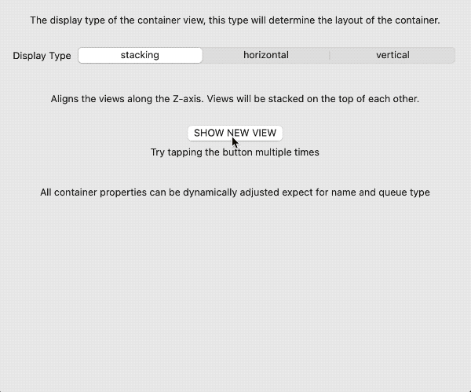
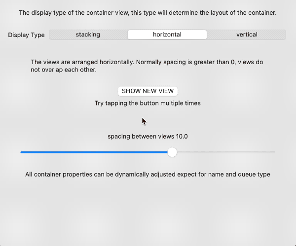
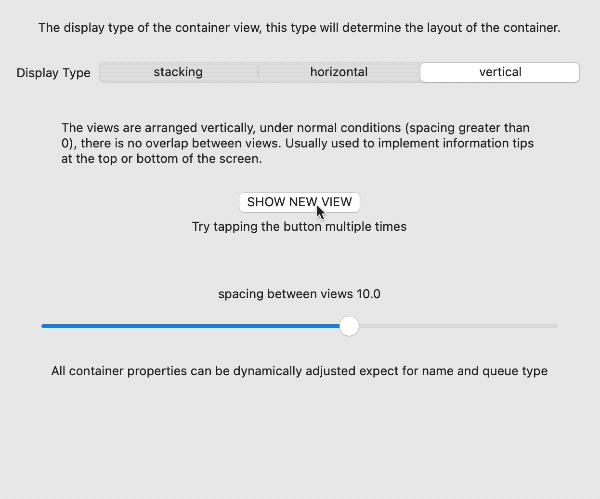
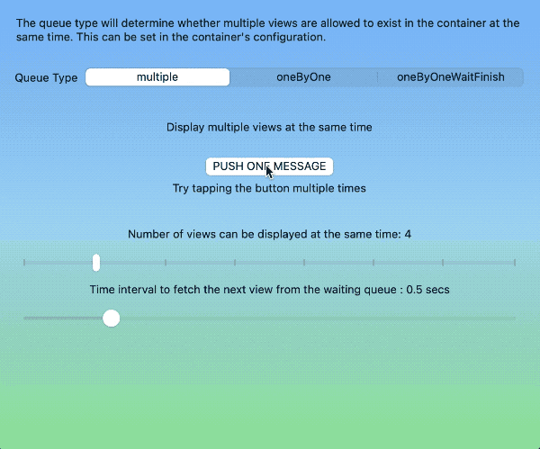
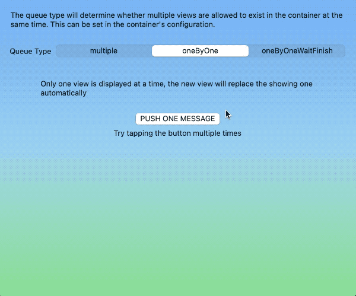
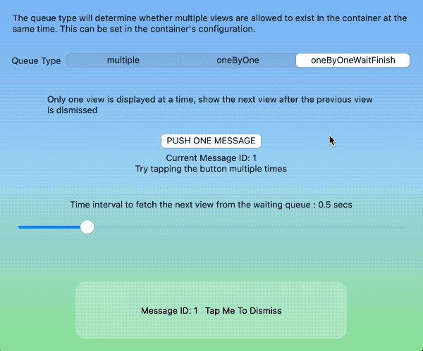

# SwiftUI Overlay Container 2

用于 SwiftUI 的高度可定制视图容器组件

 

Table of Contents
=================

* [SwiftUI Overlay Container 2](#swiftui-overlay-container-2)
   * [概述](#概述)
   * [动机](#动机)
   * [功能与特性](#功能与特性)
   * [快速使用指南](#快速使用指南)
      * [创建容器](#创建容器)
      * [在容器中显示视图](#在容器中显示视图)
      * [撤销指定容器内的所有视图](#撤销指定容器内的所有视图)
   * [基础](#基础)
      * [容器](#容器)
      * [容器显示类型（ Display type ）](#容器显示类型-display-type-)
      * [视图队列类型（ Queue Type ）](#视图队列类型-queue-type-)
      * [配置容器](#配置容器)
      * [容器环境值](#容器环境值)
      * [容器视图](#容器视图)
      * [配置容器视图](#配置容器视图)
      * [容器管理器](#容器管理器)
      * [容器管理器的环境值](#容器管理器的环境值)
      * [可屏蔽动画](#可屏蔽动画)
      * [在 SwiftUI 视图外使用](#在-swiftui-视图外使用)
   * [系统需求](#系统需求)
   * [安装](#安装)
   * [版权](#版权)
   * [帮助与支持](#帮助与支持)

## 概述

SwiftUI Overlay Container 是一个用于 SwiftUI 的视图容器组件。一个可定制、高效、便捷的视图管理器。

仅需简单配置，SwiftUI Overlay Container 即可帮你完成从视图组织、队列处理、转场、动画、交互到显示样式配置等基础工作，让开发者可以将精力更多地投入到应用程序视图的实现本身。

## 动机

当我们需要在视图的上层显示新的内容（例如：弹出信息、侧边菜单、帮助提示等）时，有很多优秀的第三方解决方案可以帮助我们分别实现，但没有一个方案可以同时应对不同的场景需求。在 SwiftUI 中，描述视图已经变得十分的容易，因此我们完全可以将上述场景中的显示逻辑提炼出来，创建出一个可以覆盖更多使用场景的库，帮助开发者组织视图的显示风格和交互逻辑。

## 功能与特性

* 支持多个容器
* 单一容器内支持多个视图
* 可在 SwiftUI 视图代码内或视图代码外向任意指定的容器推送视图
* 可以动态修改容器的配置（除了队列类型）
* 容器内的视图有多种排列方式
* 有多种队列类型以指导容器如何显示视图

## 快速使用指南

> 更详细的信息，可以参看库中的演示以及源代码中的注释。

### 创建容器

在指定视图上层创建一个视图容器，此容器的尺寸同其附着的视图尺寸一致：

```swift
VStack{
    // your view
}
.overlayContainer("containerA", containerConfiguration: AConfiguration())
```

当无需视图容器附着在某个视图时：

```swift
ViewContainer("containerB", configuration: BConfiguration())
```

### 在容器中显示视图

在视图容器 containerA 显示视图 MessageView

```swift
.containerView(in: "containerA", configuration: MessageView(), isPresented: $show, content: ViewConfiguration())
```

或者使用视图管理器

```swift
struct ContentView1: View {
    @Environment(\.overlayContainerManager) var manager
    var body: some View {
        VStack {
            Button("push view in containerB") {
                manager.show(view: MessageView(), in: "containerB", using: ViewConfiguration())
            }
        }
    }
}
```

### 撤销指定容器内的所有视图

```swift
struct ContentView1: View {
    @Environment(\.overlayContainerManager) var manager
    var body: some View {
        VStack {
            Button("push view in containerB") {
                manager.dismissAllView(in: ["containerA","containerB"], animated: true)
            }
        }
    }
}
```

## 基础

### 容器

接收并显示视图的组件。至少需要为容器设定：名称、视图显示类型、视图队列类型。

可以为容器设定默认的视图风格，对于视图未指定的风格属性，会使用容器的默认设置替代。

### 容器显示类型（ Display type ）

* stacking

  当容器内同时显示多个视图时，视图沿 Z 轴排列。其表现同 `ZStack` 类似。

  

* horizontal

  当容器内同时显示多个视图时，视图沿 X 轴排列。其表现同 `HStack` 类似。

  

* vertical

  当容器内同时显示多个视图时，视图沿 Y 轴排列。其表现与 `VStack` 类似。

  

### 视图队列类型（ Queue Type ）

* multiple

  可以同时在容器内显示多个视图。当给定的视图数量超过了容器设定的最大视图数量时，超过的视图会暂存在等待队列中，并在已显示视图取消后，逐个递补。

  

* oneByOne

  同一时间只能在容器中显示一个视图。新添加的视图将自动替换掉正在显示的视图。

  

* oneByOneWaitFinish

  同一时间能在容器中显示一个视图。只有当前正在显示的视图被撤销后，新的视图才能被显示。

  

### 配置容器

容器的配置至少要对以下属性进行设置：

```swift
struct MyContainerConfiguration:ContainerConfigurationProtocol{
    var displayType: ContainerViewDisplayType = .stacking
    var queueType: ContainerViewQueueType = .multiple
}
```

其他可以设置的属性还有：

* delayForShowingNext

  自动递补下一个视图的时间间隔

* maximumNumberOfViewsInMultipleMode

  multiple 模式下，容器内可同时显示的最多视图数量

* spacing

  vertical 、horizontal 模式下，视图之间的间隔

* insets

  在 stacking 模式下，该值为视图的内嵌值。在 horizontal 和 vertical 模式下，该值为视图组的内嵌值。

* 其他所有容器视图的配置（用作容器视图的默认值）

  详情参阅下方的配置容器视图

### 容器环境值

每个容器都为容器内的视图提供了一个环境值—— `overlayContainer` 。容器内的视图可以通过该值获取容器的信息（名称、尺寸、显示类型、队列类型）并执行撤销显示的行为。

```swift
struct MessageView: View {
    @Environment(\.overlayContainer) var container
    var body: some View {
        RoundedRectangle(cornerRadius: 10)
            .frame(width: 300, height: 10)
            .overlay(
                HStack {
                    Text("container Name:\(container.containerName)")
                    Button("Dismiss me"){
                        container.dismiss()
                    }
                }
            )
    }
}
```

### 容器视图

所有的 SwiftUI 视图都可以在容器内显示。你可以为类似功能的视图创建同一个视图配置，或者让某个特定视图遵循 ContainerViewConfigurationProtocol 协议，单独进行设置。

### 配置容器视图

```swift
public protocol ContainerViewConfigurationProtocol {
    var alignment: Alignment? { get }
    var tapToDismiss: Bool? { get }
    var backgroundStyle: ContainerBackgroundStyle? { get }
    var backgroundTransitionStyle: ContainerBackgroundTransitionStyle { get }
    var shadowStyle: ContainerViewShadowStyle? { get }
    var dismissGesture: ContainerViewDismissGesture? { get }
    var transition: AnyTransition? { get }
    var autoDismiss: ContainerViewAutoDismiss? { get }
    var disappearAction: (() -> Void)? { get }
    var appearAction: (() -> Void)? { get }
    var animation: Animation? { get }
}
```

* alignment

  设置视图或视图组在容器中的 alignment。stacking 模式下，可以为每个视图设置不同的 alignment，在 vertical 或 horizontal 模式下，所有视图（视图组）共用容器的 alignment 设置。

* tapToDismiss

  在为视图设置了 backgroundStyle 的情况下，是否允许通过点击背景来撤销视图。

  *详情参看项目演示代码*

* backgroundStyle

  为容器视图设置背景。目前支持 color、blur、customView。

  部分版本的操作系统（iOS 14，watchOS ）不支持 blur 模式，如果想在这些版本中使用 blur，可以通过 customView 来包裹其他的 blur 代码。

  *详情参看项目演示代码*

* backgroundTransitionStyle

  背景的转场。默认为 opacity， 设置为 identity 可取消转场。

* shadowStyle

  为视图添加阴影

* dismissGesture

  为视图添加取消手势，目前支持 单击、双击、长按、左划、右划、上划、下划、自定义。

  自定义手势需使用 `eraseToAnyGestureForDismiss` 对类型进行擦除。

  ```swift
  let gesture = LongPressGesture(minimumDuration: 1, maximumDistance: 5).eraseToAnyGestureForDismiss()
  ```

  在 tvOS 下，仅长按被支持

  *详情参看项目演示代码*

* transition

  视图的转场

* animation

  视图转场的 animation

* autoDismiss

  是否支持自动撤销。 `.seconds(3)` 表示 3 秒后视图会自动撤销。

  *详情参看项目演示代码*

* disappearAction

  视图被撤销后执行的闭包

* appearAction

  视图在容器中显示前执行的闭包

### 容器管理器

容器管理器是程序代码与容器之间的桥梁。使用者通过调用容器管理器的特定方法，让指定的容器执行显示视图、撤销视图等工作。

### 容器管理器的环境值

在 SwiftUI 中，视图代码通过环境值调用容器管理器。

```swift
struct ContentView1: View {
    @Environment(\.overlayContainerManager) var manager
    var body: some View {
        VStack {
            Button("push view in containerB") {
                manager.show(view: MessageView(), in: "containerB", using: ViewConfiguration())
            }
        }
    }
}
```

容器管理器目前提供的方法有：

* show(view: Content, in container: String, using configuration: ContainerViewConfigurationProtocol, animated: Bool) -> UUID?

  在指定的容器中显示视图，返回值为视图的 ID

* dismiss(view id: UUID, in container: String, animated flag: Bool)

  在指定的容器中，撤销指定 ID 的视图

* dismissAllView(notInclude excludeContainers: [String], onlyShowing: Bool, animated flag: Bool)

  撤销除了指定的容器外其他所有容器中的视图，当 onlyShow 为真时，仅撤销正在显示的视图。

* dismissAllView(in containers: [String], onlyShowing: Bool, animated flag: Bool)

  撤销指定容器内的所有视图

### 可屏蔽动画

无论是直接调用容器管理器还是使用 View modifier，当将 animated 设为 false 时，均可强制取消转场动画。

对于处理例如 Deep Link 之类的场景时十分有效。

### 在 SwiftUI 视图外使用

如果想在 SwiftUI 视图之外调用容器管理器，可以直接调用 ContainerManager 的单例：

```swift
let manager = ContainerManager.share
manager.show(view: MessageView(), in: "containerB", using: ViewConfiguration())
```

## 系统需求

* iOS 14+
* macOS 11+
* tvOS 14+
* watchOS 7+

## 安装

安装 SwiftUIOverlayContainer 的首选方式是通过 Swift Package Manager。

```swift
dependencies: [
  .package(url: "https://github.com/fatbobman/SwiftUIOverlayContainer.git", from: "2.0.0")
]
```

## 版权

这个库是在 MIT 许可下发布的。详见 [LICENSE](LICENSE)。

## 帮助与支持

可以通过创建 Issues 来反馈你的意见或建议。也可以通过 Twitter [@fatbobman](https://twitter.com/fatbobman) 与我联络。
